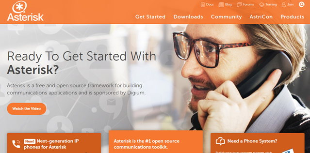

#### 【倉庫内無線LAN環境】 アンドロイド端末で無料通話をしてみよう
　  

　  
　  
　　　　　id:kakisoft
---
### 自己紹介  
　  
**名前**：垣花　暁（かきのはな　さとる）    
　  
**出身**：沖縄県  
　  
**仕事**：物流系エンジニア  
.NET/Java/Oracleがメイン。  
物流業界向けの言語や機器が使えます。  
　  
**趣味**：リアル脱出ゲーム
---
福岡と広島に、Androidタブレットを使った、  
ピッキング（出荷）と棚卸のシステムを  
導入しました。
---
現場「これ（Android端末）使って、  
通話もできない？」
---
調べてみた。  
何かできそうな気がする。
---
### IP PBX
**（Intenet Protocol Private Branch eXchange）**
 
TCP/IP上で音声通話（VoIP）を利用する際、  
IP電話機の回線交換を行う機器やソフト。  
IP回線交換装置とも。
---
### PBXには２種類ある
 * ハードウェアタイプ  
   　専用の機器を使用する
 * ソフトウェアタイプ  
   　サーバにインストールして使用する
  
*→今回必要なのは、ソフトウェアタイプ。*
---
**Asterisk（アスタリスク）**というオープンソースのツールを使用。
内線電話を実現できるそうな。

http://www.asterisk.org/
  
サーバにて使用します。Cent OSを使用しました。
---
クライアント（今回は Android）には、SIPクライアントツールが必要となります。  
（「ソフトフォン」とも言います。）  
 
以下の３つを試しました。
 * Zoiper IAX SIP VOIP Softphone
 * CSipSimple
 * MizuDroid SIP Softphone
 
手軽にサクッと使う分には、MizuDroidが良さげです。
---
基本、Qiitaの記事を参考にしました。
---
導入の予定は・・・
---
特にありません。(´・ω・`)
---
おわり
